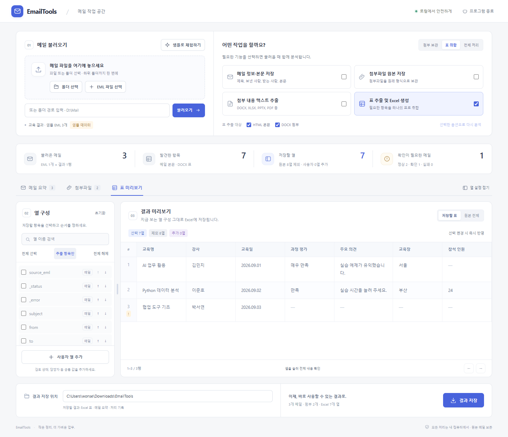

# EmailTools 2.0

Windows 포터블 Python으로 실행하는 EML 통합 도구입니다. **최상위 `run.bat` 하나**에서
메일 본문 저장, 첨부 원본 저장, 첨부 텍스트 분석, 표 추출을 선택합니다.

실행 순서는 **`run.bat → 내장 Python → 로컬 서버(127.0.0.1) → 기본 브라우저`**입니다.
화면 디자인을 바꾼 뒤에도 실행·분석·저장 방식은 동일하며, 메일은 내 컴퓨터에서 처리합니다.

**처음 사용하는 분을 위한 설명서:** [HTML 설명서](docs/user-manual.html) ·
[PowerPoint 설명서](docs/EmailTools_User_Manual.pptx)

실제 프로그램 화면을 보며 실행부터 샘플 연습, 항목 추가·제외, 내 메일로 작업하기와
결과 저장까지 따라 할 수 있습니다. `docs/user-manual.html`을 더블클릭하면 인터넷 없이
읽을 수 있고, PowerPoint 설명서는 교육이나 안내 자료로 사용할 수 있습니다.

## 시작하기

1. `run.bat`을 더블클릭합니다. Python이 실행되고 기본 브라우저에 로컬 작업 화면이 열립니다.
2. **어떤 작업을 할까요?**에서 실행 옵션을 선택합니다. `첨부 보관`, `표 취합`, `전체 처리` 버튼으로 빠르게 선택할 수 있습니다.
3. EML 파일/폴더 경로를 입력하거나 **폴더 선택 / EML 파일 선택**을 누릅니다.
   EML 파일을 화면에 끌어 놓거나 파일/폴더를 BAT에 Drag & Drop해도 됩니다.
4. **메일 요약 / 첨부파일 / 표 미리보기**에서 결과를 확인합니다.
5. 결과 저장 위치를 확인하고 **결과 저장**을 누릅니다.

**메일 불러오기** 제목 옆의 **샘플로 체험하기**는 개인 메일 없이 합성 EML 3개와 DOCX 표를 분석합니다.
예: `표 취합 → 샘플로 체험하기 → 추출 항목만 → 교육일 체크 해제 → 사용자 열 추가`.



## 실행 옵션

| 옵션 | 동작 |
|---|---|
| 메일 정보·본문 저장 | 제목, 발신자, 수신자, 본문을 `mail.txt`로 저장 |
| 첨부파일 원본 저장 | 첨부파일을 원래 형식으로 저장 |
| 첨부 내용 텍스트 추출 | TXT/CSV/JSON/HTML 등 텍스트와 DOCX/XLSX/PPTX/PDF/첨부 EML 분석 |
| 표 추출 및 Excel 생성 | HTML 본문 및 DOCX 첨부의 항목/값 표를 모아 Excel 생성 |

- 네 가지 기능은 독립적으로 조합할 수 있습니다. 텍스트나 표만 추출할 때는 첨부 원본을
  결과 폴더에 저장하지 않습니다.
- 표 추출 대상은 **HTML 본문 / DOCX 첨부** 중 선택합니다. PDF/XLSX/PPTX는 현재
  텍스트 추출 대상이며 구조화된 표 추출 대상은 아닙니다.
- `첨부 보관`은 메일 본문+첨부 원본, `표 취합`은 표 추출, `전체 처리`는 네 기능 모두를 선택합니다.
- 분석 후 옵션을 바꾸면 저장 버튼이 비활성화됩니다. **선택한 옵션으로 다시 분석**하면
  현재 입력을 새 옵션으로 분석합니다. 열 구성은 초기화됩니다.
- 긴 분석은 **분석 중지**로 중지할 수 있습니다. 현재 메일의 처리를 마친 뒤 중지하며,
  중지된 분석 결과는 저장할 수 없습니다.

## 표 미리보기

- **열 설정 접기 / 열 설정 펼치기**로 미리보기 공간을 넓히거나 열 구성을 다시 표시할 수 있습니다.
  넓은 창에서는 열 설정과 미리보기 사이의 구분선을 드래그하거나, 구분선에 초점을 맞추고
  좌우 방향키로 너비를 조절하세요. Home/End 키는 조절 가능한 최소/최대 너비로 이동합니다.
- 좁은 창에서는 열 설정과 미리보기가 세로로 배치되고 구분선은 숨겨집니다. 열 목록과 넓은 표는 각 영역 안에서
  스크롤되므로 창 크기를 바꾸어도 작업을 이어갈 수 있습니다.
- EML 하나가 결과의 한 행입니다. 항목은 최초 등장 순서대로 열을 만듭니다.
- 체크 해제로 열을 제외하고 다시 체크해서 원본 값을 복원합니다. ↑/↓로 순서를 바꿉니다.
- **사용자 열 추가**로 검토 상태나 담당자 등 공통 값을 넣습니다. 모든 행에 동일한 값이 들어가며
  빈 값도 가능합니다. 추가한 열은 보라색으로 표시하고 연필 버튼으로 수정합니다.
- **저장할 표 / 원본 전체**로 비교합니다. 저장은 항상 선택한 구성을 사용합니다.
- 25행씩 미리 보며 Excel에는 **전체 행**을 저장합니다. 셀을 누르면 전체 내용을 볼 수 있습니다.
- 빈 셀은 화면에서 `—`, Excel에서는 빈 셀로 표시합니다. 열을 모두 제외하면 Excel을 저장할 수 없습니다.
- 누락된 표나 분석 오류는 행의 상태와 처리 로그에 남깁니다. 한 메일의 오류가 나머지 메일 분석을
  중단시키지 않습니다.

항목명은 공백/줄바꿈/앞뒤 구두점을 정리하며 fuzzy matching은 하지 않습니다.
동일 항목의 같은 값은 한 번만, 서로 다른 값은 `값1 | 값2`로 보존합니다.
기본 메일 정보 열은 `source_eml`, `_status`, `_error`, `subject`, `from`, `to`, `date`,
`docx_filename`이며, 이 이름과 같은 추출 항목에는 `item_` 접두사를 붙입니다.

## 결과 저장

선택한 결과 위치 아래에 실행마다 새 폴더를 만듭니다. 이전 결과를 덮어쓰지 않습니다.

```text
결과 위치/
└─ 20260906_153000_<작업ID>/
   ├─ .emailtools-job.json
   ├─ mails/
   │  └─ 000001_메일이름/
   │     ├─ mail.txt
   │     ├─ attachments/          # 원본 저장 선택 시
   │     └─ text/                 # 텍스트 추출 선택 시
   ├─ tables/
   │  └─ EML_Table_Result.xlsx    # 표 추출 선택 시, Worksheet: Result
   ├─ summary.csv
   ├─ attachments.csv
   ├─ processing.log
   └─ EmailTools_Result.zip       # 화면에서 저장할 때 전체 결과 묶음
```

- 메일/첨부/텍스트/Excel은 선택한 기능에 해당하는 파일만 생성합니다.
- `summary.csv`는 메일별 정보·첨부 수·처리 상태를, `attachments.csv`는 첨부별 분석 상태와
  저장된 첨부·텍스트 파일의 상대 경로를 기록합니다.
- 로컬 경로 입력 시 저장 위치는 `입력 위치/_EML_OUTPUT`을 제안합니다.
  브라우저 파일 선택/샘플은 `사용자 Downloads/EmailTools`를 제안합니다. 자유롭게 변경할 수 있습니다.
- **저장 위치를 비우면 다운로드만 제공합니다.** 이때 서버의 임시 결과는 프로그램 종료 시
  삭제되므로 브라우저 다운로드로 보관하세요.
- 표만 선택하면 XLSX를, 다른 기능도 선택하면 ZIP을 다운로드합니다. 저장 후 개별 Excel과
  전체 ZIP, 처리 로그도 다시 받을 수 있습니다.

## 실행 경로와 배포

```text
EmailTools/
├─ run.bat                      # 사용자 실행 진입점
├─ main.py                      # GUI/CLI 및 이전 실행 방식 분기
├─ setup_runtime.bat
├─ runtime/python/              # 내장 Python 하나
├─ vendor/                      # pypdf, openpyxl, et_xmlfile
├─ THIRD_PARTY_LICENSES/
├─ emailtools/
│  ├─ models.py                 # 옵션과 분석 결과
│  ├─ reader.py                 # EML 검색과 공통 MIME 읽기
│  ├─ pipeline.py               # 선택한 기능 실행
│  ├─ table_config.py           # 열 설정 검증과 데이터 선택
│  ├─ extractors/               # 첨부 / 텍스트 / 표
│  ├─ exporters/                # 파일 / Excel
│  ├─ ui/server.py              # Python 로컬 화면 서버
│  ├─ ui/static/                # HTML/CSS/JavaScript
│  └─ compat/                   # 기존 콘솔 결과 형식 어댑터
├─ eml_attachment_tool/         # 이전 경로 호환용 진입 파일만 유지
├─ eml_table_to_excel/          # 이전 경로 호환용 진입 파일만 유지
├─ docs/
├─ tests/
└─ tools/build_portable.py
```

프로그램은 `runtime/python/python.exe`만 실행합니다. 시스템의 `python`/`py`, Node.js,
Tkinter, pip 설치가 필요하지 않습니다. UI 자원과 분석은 `127.0.0.1`에서 실행하며 메일을
외부 서버로 보내지 않습니다.

Python이 없으면 `setup_runtime.bat`이 다음 순서로 준비합니다.

1. 이전 설치의 `eml_attachment_tool/python`이 있으면 재사용합니다. 이전 런타임은 백업으로 남깁니다.
2. 최상위에 `python-3.13.15-embed-amd64.zip`이 있으면 오프라인으로 설치합니다.
3. 둘 다 없으면 Python.org에서 해당 Windows Embeddable ZIP을 내려받습니다.

런타임은 임시 위치에서 확인한 뒤 실행 위치에 옮깁니다. `pypdf 5.9.0`, `openpyxl 3.1.5`,
`et_xmlfile 2.0.0`은 `vendor/`에 포함합니다. 라이선스는 `THIRD_PARTY_LICENSES/`,
`vendor/*dist-info/`, `runtime/python/LICENSE.txt`에 있습니다.

## 콘솔 모드

```bat
rem 기본: 표 추출
run.bat --cli "D:\Mail"

rem 첨부 원본만 저장
run.bat --cli "D:\Mail" --attachments

rem 첨부 텍스트와 표를 함께 추출
run.bat --cli "D:\Mail" --text --tables --output "D:\MailResults"

rem 전체 처리
run.bat --cli "D:\Mail" --all

rem DOCX 표만 추출
run.bat --cli "D:\Mail" --tables --table-source docx

run.bat --cli --help
```

`--mail`, `--attachments`, `--text`, `--tables`를 조합합니다. 기능 옵션을 생략하면 표 추출입니다.
`--columns-file columns.json`으로 아래와 같은 열 설정을 적용할 수도 있습니다.

```json
[
  {"source": "교육명", "name": "교육명", "enabled": true},
  {"source": null, "name": "검토 상태", "value": "검토 대기", "enabled": true}
]
```

종료 코드는 정상 `0`, 처리/저장 실패 `1`, 일부 메일/첨부 분석 오류 `2`, 사용자 중지 `130`입니다.
단순한 표/첨부 누락은 로그에 남기고 정상 종료합니다. 명령 인자 오류도 `2`로 반환됩니다.
자동 실행에서 오류 시 BAT의 일시 정지를 생략하려면 환경변수 `EMAILTOOLS_NO_PAUSE=1`을 설정합니다.

## 이전 실행 방식 호환

- `eml_attachment_tool/run.bat` 및 `eml_attachment_tool/app.py`: 기존 첨부 콘솔 모드와
  `_EML_OUTPUT` 결과 형식을 유지합니다.
- `eml_table_to_excel/run.bat`: 통합 화면을 엽니다.
- `eml_table_to_excel/run.bat --cli` 및 `eml_table_to_excel/app.py`: 기존 표 콘솔 모드와
  입력 위치의 `EML_Table_Result.xlsx`, `EML_Table_Result_errors.log`를 유지합니다.
- 이전 BAT도 최상위 진입점과 동일한 내장 Python을 사용합니다. 두 기존 폴더는 독립 프로그램이
  아니며, 통합 프로그램 전체와 함께 배포해야 합니다.

## 안정성 및 사용 범위

- 원본 EML은 읽기만 합니다. 첨부와 실행 파일/스크립트는 데이터로만 취급하며 실행하지 않습니다.
- 분석 시에는 최종 결과를 저장하지 않습니다. 원본 저장을 선택한 첨부는 임시 폴더에 보관해
  미리보기 후 입력 파일이 바뀌어도 분석한 데이터로 저장합니다.
- 저장은 임시 결과 폴더에서 완료한 뒤 게시합니다. 실패 시 미완성 결과만 정리하고 기존 결과는 보존합니다.
- 기존 `_EML_OUTPUT`, 새 결과 폴더와 임시 작업 폴더, 디렉터리 링크는 자동 검색에서 제외합니다.
- 첨부 파일명은 경로를 제거하고 같은 이름 충돌을 회피합니다. 첨부 EML의 본문/표를 부모 메일에 섞지 않습니다.
- Excel 수식처럼 보이는 값은 문자열로 저장합니다. CSV의 수식처럼 보이는 메타데이터에는
  작은따옴표를 붙입니다. Excel 셀 길이 초과/제어문자 보정은 로그에 기록합니다.
- 브라우저 파일 선택은 5,000개/총 64 MB까지입니다. 더 큰 입력은 폴더 경로를 사용하세요.
- Office XML은 각 XML 파일당 32 MB까지 분석합니다. PDF는 텍스트 레이어를 읽으며 OCR은 하지 않습니다.
  암호/DRM 적용 파일, 손상 파일은 분석에 제한이 있으며 다른 파일 처리는 계속합니다.
- 열 구성은 현재 화면에서 유지됩니다. 새로고침/새 입력/재분석/초기화 시 기본 구성으로 돌아갑니다.
- **프로그램 종료** 또는 BAT 창의 `Ctrl+C`로 종료합니다. 탭만 닫으면 Python은 계속 실행됩니다.

## 개발 및 테스트

```bat
runtime\python\python.exe -X utf8 -m unittest discover -s tests -v
```

테스트는 임시 폴더의 합성 EML/문서만 사용합니다. 기존 회귀 테스트, 기능 15개 조합,
입력 보존, 오류 후 계속 처리, 중지/재분석, 저장 실패 복구, 포터블 배포와 오프라인 설치를 검증합니다.
자세한 검증 범위는 [테스트 문서](docs/testing.md)를 참고하세요.

개발용 Node.js/Playwright/Edge가 있는 환경에서는 브라우저 회귀 테스트도 실행할 수 있습니다.

```bat
node tests/gui_smoke.cjs
rem Playwright를 별도 위치에서 사용할 경우
node tests/gui_smoke.cjs "C:\path\to\node_modules\playwright"
```

사용자 실행에는 Node.js나 Playwright가 필요하지 않습니다.
배포본은 `runtime\python\python.exe tools\build_portable.py`로 생성합니다.

[내부 구조와 확장 방법](docs/architecture.md)
