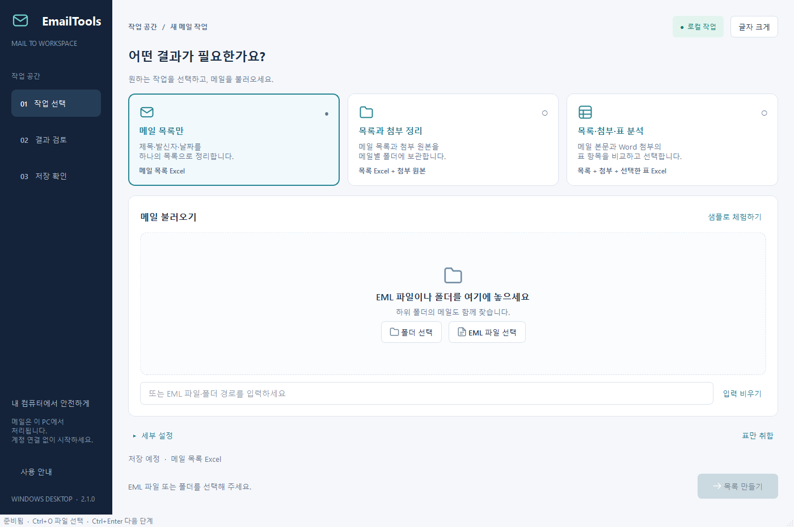
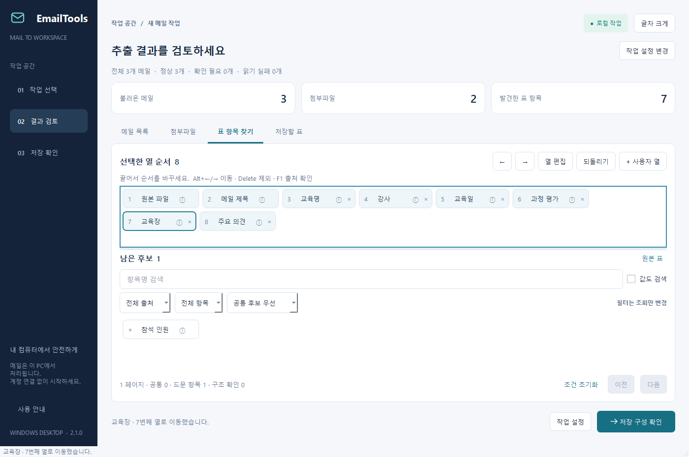
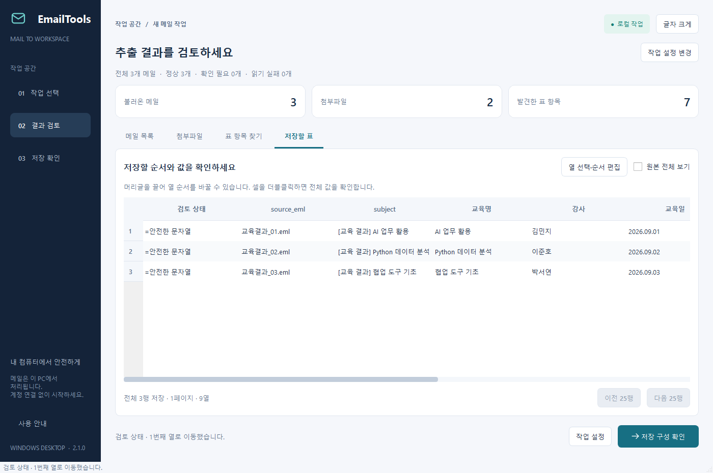
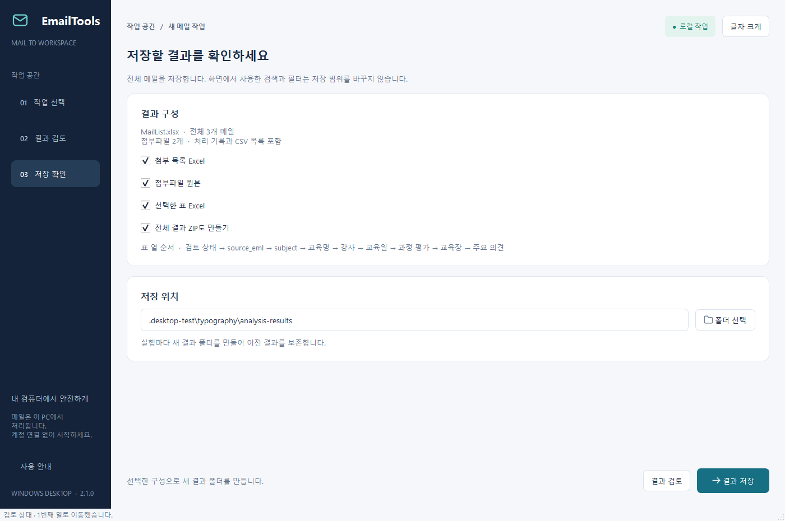
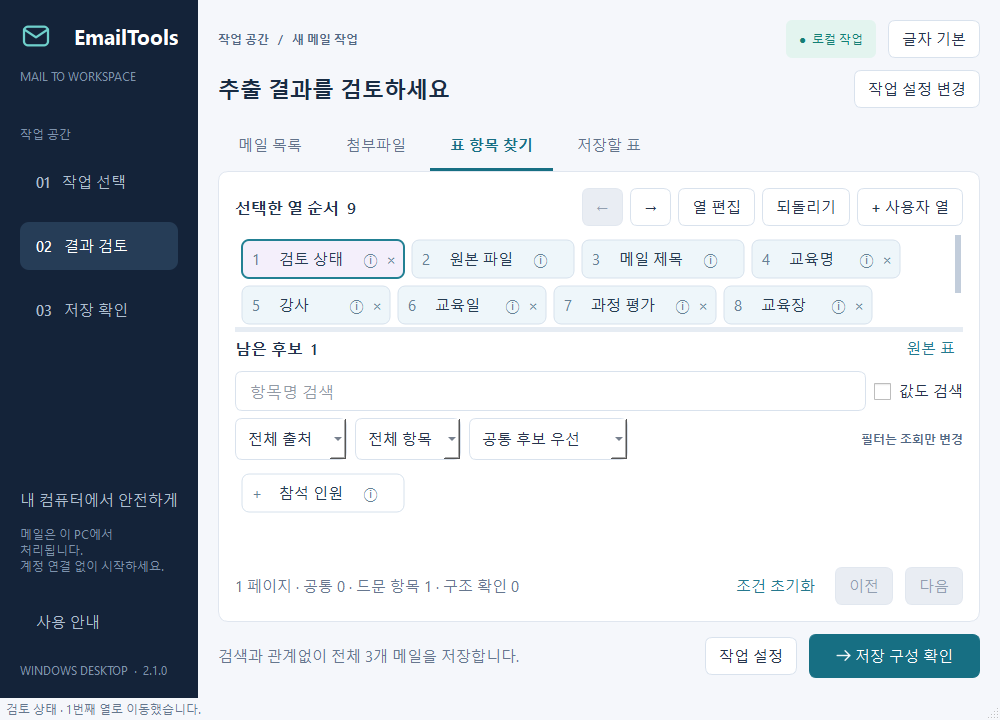

# Windows UI 디자인

PySide6 Qt Widgets를 사용하며 브라우저/WebView를 컨테이너로 사용하지 않는다.
남색 탐색 영역, 밝은 작업 바탕, 흰 패널, 청록색 주요 동작으로 작업 선택 → 검토 → 저장을 구분한다.

2026-09-10 사용자의 글꼴 축소 요청에 따라 계획안보다 작은 네이티브 앱 글꼴을 적용했다.

| 요소 | 기본 크기 |
|---|---|
| 본문·표·버튼 | 13px |
| 입력 | 14px |
| 보조 안내 | 12px |
| 구역 제목 | 16px |
| 화면 제목 | 22px |
| 큰 글자 모드 | 본문 15px, 입력 16px |

기본 표 행과 항목 버튼은 40px 이상이다. Windows 시스템 글꼴과 자체 SVG 아이콘을 사용한다.
창 높이 850px 미만에서는 검토 통계와 중복 안내를 접어 두 항목 목록 공간을 확보한다.

자동 줄바꿈·내부 스크롤, QDrag 버튼 이미지·삽입선, 키보드 이동·되돌리기를 제공한다.
안정된 열 ID 순서를 미리보기와 Excel에서 공유한다.

실제 Windows Qt 창의 캡처다. Qt 이벤트·키보드·머리글 조작과 실제 저장 결과를 검증했다.
외부 Computer Use 연결 실패로 물리 마우스·터치 조작은 검증하지 못했다.
